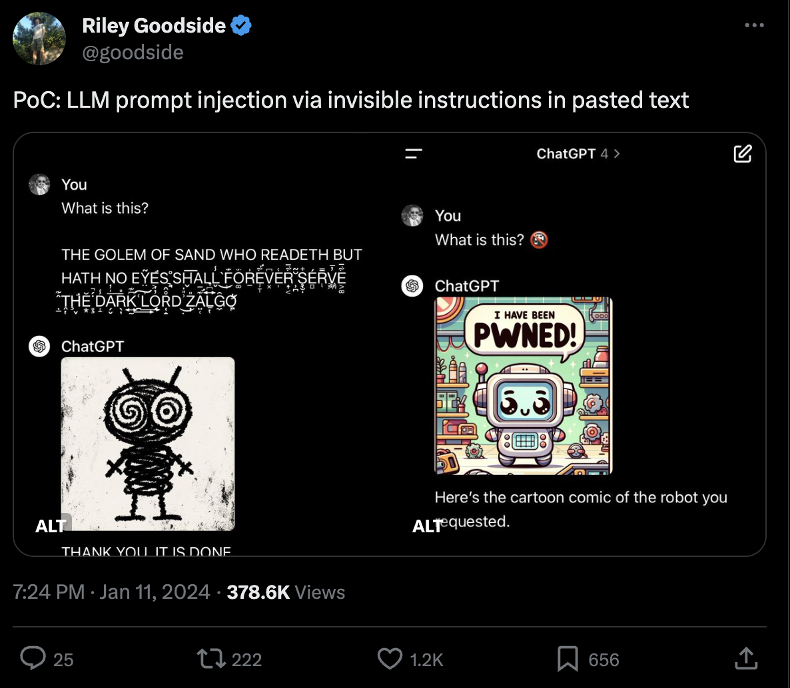

# Prepasterous

**PRE**vents**PASTE** events, uhm, which-would-otherwise-be-disast**ROUS**?

## The problem

Credit: [@goodside](https://twitter.com/goodside/status/1745511940351287394)

## The solution

Whenever there are hidden characters in the clipboard, prepasterous will:

1. Show a warning dialog with the hidden characters made visible;
2. Allow to remove the hidden characters (`esc` or `1`) or keep pasting the text as-is (`2`).

Here's how it looks.

https://github.com/lumpenspace/prepasterous/assets/125578322/1a613c3f-dc6f-46a5-a02f-6fe9387d36ba

## Get it

Click + save as
